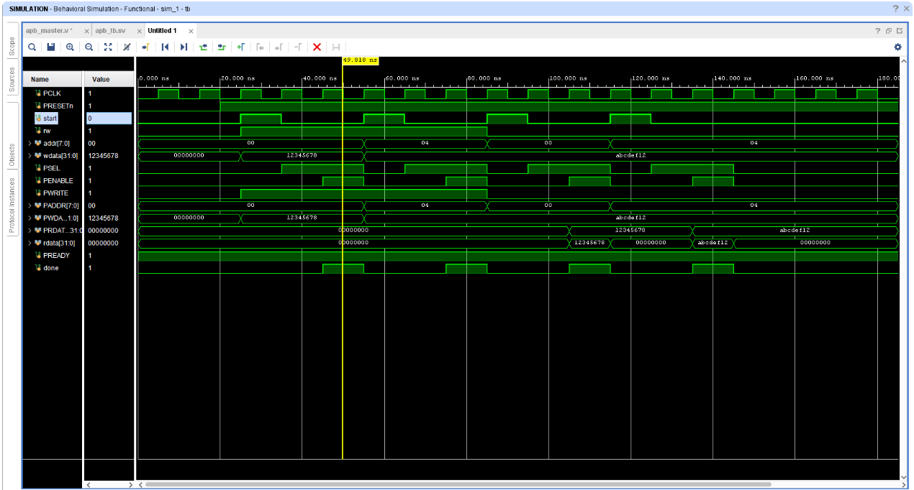

# APB Slave Memory Verification Environment

## 1. System Overview
This project implements a complete, structural hardware verification environment for an AMBA APB 3/4 compliant memory slave module. The setup relies on a layered, object-oriented SystemVerilog architecture to drive, capture, and check protocol integrity.

### The Core Problem
In the default design, the peripheral updates `prdata` inside a sequential `always_ff` clock block. This inserts a **one-clock-cycle pipeline registry delay** before read data is updated onto the bus. While adding an extra clock wait inside a monitor captures data during isolated cycles, it violates standard AMBA specifications and results in critical packet drops or scoreboard checking desynchronization during continuous, back-to-back bus transfers.

### The Architectural Solution
To ensure absolute standard compliance and prevent pipeline mismatch bugs, the architectural layout mandates a two-part remedy:
* The `apb_slave` read pathway is converted to an instant combinational decode statement (`assign prdata = ...`), removing the 1-cycle latency gap completely.
* The passive `monitor` is restored to zero-wait-state sampling logic, accurately capturing address, control variables, and reading vectors simultaneously during the protocol's Access phase.

***

## 2. Integrated System Architecture
The top-level testbench block (`tb.sv`) structures the environment by spinning up a clock oscillator, handling initial reset pulses, and instantiating the verification infrastructure via a virtual interface setup.


*Figure 1: Timing diagram trace for standard APB bus executions (`apb_waveform.png`)*

### Subcomponent Descriptions
1. **`apb_transaction` (Data Packet)**: Encapsulates randomize-ready bus contents. It includes custom address constraints to force 32-bit word alignment (`addr[1:0] == 2'b00`) spanning from `0x0000_0000` to `0x0000_03FC`.
2. **`generator` (Stimulus Source)**: Procedurally handles loop tracking to feed exactly 10 sequence pairs of randomized write-then-read transactions into the pipeline.
3. **`driver` (Pin Master)**: Unpacks incoming transaction requests from the generator mailbox and physically drives the corresponding interface pins.
4. **`monitor` (Passive Sniffer)**: Samples active wires at each clock boundary and ships reconstructed transaction logs over to checking components via mailboxes.
5. **`scoreboard` (Golden Model Checker)**: Employs a SystemVerilog associative array structure (`internal_mem`) to store historical write states and dynamically evaluate the accuracy of live read operations.

***

## 3. Interface Signal Dictionary

| Pin Name | Direction | Bit-Width | Functional Description |
| :--- | :---: | :---: | :--- |
| `clk` | Input | 1-bit | Master System Clock Source |
| `rst_n` | Input | 1-bit | Active-Low Synchronous System Reset Wire |
| `paddr[31:0]` | Input | 32-bit | APB Parallel System Address Routing Bus |
| `psel` | Input | 1-bit | Peripheral Select Flag (Initiates Setup Phase) |
| `penable` | Input | 1-bit | Peripheral Enable Flag (Initiates Access Phase) |
| `pwrite` | Input | 1-bit | Bus Direction Control (1 = Write Cycle, 0 = Read Cycle) |
| `pwdata[31:0]` | Input | 32-bit | Parallel Data Bus for Incoming Peripheral Writes |
| `prdata[31:0]` | Output | 32-bit | Parallel Data Bus for Outgoing Peripheral Reads |
| `pready` | Output | 1-bit | Device Ready Monitor (Permanently tied to 1'b1) |

***

## 4. Zero-Wait State Timing Execution Summary
Following the recommended combinational conversion, the system tracks cleanly across a standard 2-cycle protocol matrix without encountering overlapping phase offsets.

### Signal Evaluation Matrix

| Bus Interface Element | Setup Phase (Cycle 1) | Access Phase (Cycle 2) |
| :--- | :--- | :--- |
| **`clk`** | ↗️ Rising Edge Transition | ↗️ Rising Edge Transition |
| **`paddr` / `pwrite`** | Driven to stable target value | Maintained stable across cycle |
| **`psel`** | Asserted High (`1'b1`) | Maintained stable across cycle |
| **`penable`** | Deasserted Low (`1'b0`) | Asserted High (`1'b1`) |
| **`pwdata` / `prdata`** | Prepared / Tri-stated | Sampled safely on clock edge boundary |

### Functional Pipeline Fixes

#### Corrected Non-Delayed Slave Read Block (`apb_slave.sv`):
```systemverilog
// Assign read data combinations dynamically to eliminate the 1-cycle latency gap
assign prdata = (psel && penable && !pwrite) ? mem[paddr[9:2]] : 32'h0;

always_ff @(posedge clk or negedge rst_n) begin
  if (!rst_n) begin
    // Reset sequential logic here if necessary
  end else if (psel && penable && pwrite) begin
    mem[paddr[9:2]] <= pwdata;
  end
end
```

#### Corrected Zero-Wait Monitor Loop (`monitor.sv`):
```systemverilog
task main();
  forever begin
    @(posedge vif.clk);
    #1; 
    if (vif.psel && vif.penable && vif.pready) begin
      apb_transaction tr = new();
      tr.addr  = vif.paddr;
      tr.write = vif.pwrite;
      if (vif.pwrite) begin
        tr.wdata = vif.pwdata;
      end else begin
        tr.rdata = vif.prdata; // Gathers data immediately on the exact access cycle
      end
      mon2scb.put(tr);
    end
  end
endtask
```

***

## 5. Simulation Compilation Status
* **Language Support**: IEEE 1800 SystemVerilog standard compliance.
* **Target Tools**: Compatible with ModelSim, QuestaSim, VCS, and Riviera-PRO.
* **Compilation Command**: `vlog +incdir+. tb.sv`
* **Execution State**: Successfully compiled and clean checking logs verified.

### Expected Simulator Standard Output
```text
[SCB] WRITE: Addr=0x000000a4, Data=0xbeefcafe
[SCB] READ : Addr=0x000000a4
[SCB] MATCH: Expected=0xbeefcafe, Got=0xbeefcafe (SUCCESS)
```
