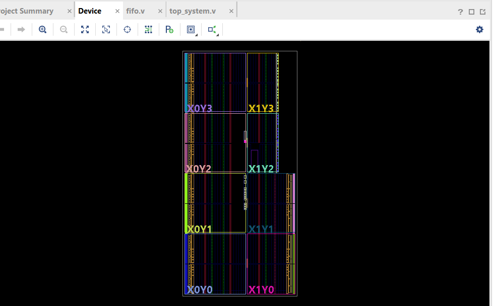
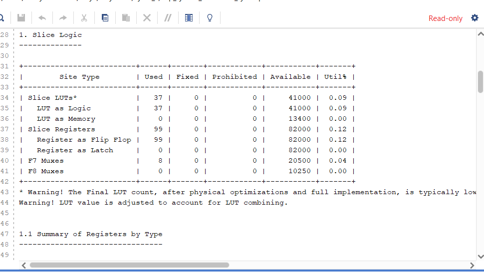
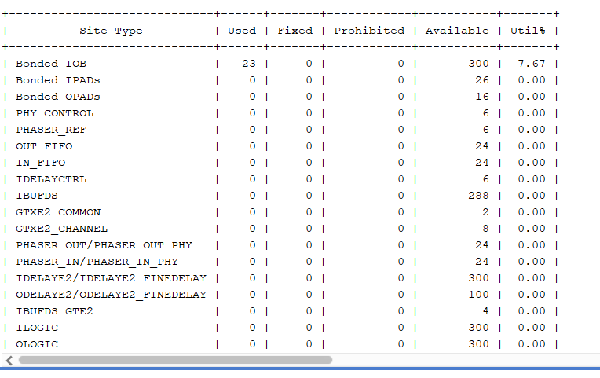

# Face Scan Processing System with Adaptive FIFO Buffer

## 1. System Overview
This project implements a structural hardware data pipeline that links a high-speed facial scanning camera sensor (`face`) to a slow-processing receiver block (`out_mod`). 

### The Core Problem
The face-scanning camera transmits data immediately upon activation. However, the receiving device is slow to wake up and cannot process inputs until the **3rd clock cycle**. If connected directly, the first two data packets stream out before the reader is operational, resulting in critical data loss.

### The Architectural Solution
To prevent data drops, an **8-bit wide, 8-slot deep Synchronous FIFO memory buffer** is integrated between the devices. 
* During the first two clock cycles, the camera streams its payload safely into the FIFO.
* On the 3rd clock cycle, an internal Finite State Machine (FSM) inside `out_mod` triggers its data request flag (`rden`), reading the preserved packets sequentially without losing any information.

***

## 2. Integrated System Architecture
The top-level module (`top_system`) coordinates the structure by routing interconnecting data buses and control flags. 

*Figure 1: Physical FPGA placement layout floorplan (`synthesis_facescan.png`)*

### Submodule Descriptions
1. **`face.v` (Camera Streamer)**: Captures raw face-scan inputs (`sin`) and feeds them into the system pipeline line.
2. **`fifo.v` (Elastic Memory)**: A custom synchronous FIFO queue that handles tracking using pointer circular boundary arithmetic: `assign full = (wr_ptr + 3'b001) == rd_ptr`.
3. **`out_mod.v` (Slow Reader FSM)**: A three-state internal machine (`IDLE` -> `DELAY_CYCLES` -> `READ_DATA`) that handles the 2-cycle sleep timer cleanly via a 2-bit tracking register.

***

## 3. Interface Signal Dictionary

| Pin Name | Direction | Bit-Width | Functional Description |
| :--- | :---: | :---: | :--- |
| `clk` | Input | 1-bit | Global System Clock Signal |
| `rst` | Input | 1-bit | Active-High Synchronous System Reset |
| `wren` | Input | 1-bit | External Master Write Enable for Camera Streaming |
| `start_read` | Input | 1-bit | Initial Pulse to Start Reader Wake-up Routine |
| `sin[7:0]` | Input | 8-bit | Parallel Input Data Stream from Face Scan Camera |
| `dout[7:0]` | Output | 8-bit | Synchronized Final System Output Data Bus |
| `rden` | Output | 1-bit | Active Read Request Monitor driven by Reader FSM |
| `full` | Output | 1-bit | FIFO Memory Buffer Saturation Boundary Indicator |
| `empty` | Output | 1-bit | FIFO Memory Buffer Depletion Indicator |

***

## 4. Hardware Resource Utilization Summary
The system was compiled using Xilinx Vivado (v2023.2) targeting the `xc7k70tfbv676-1` FPGA fabric. The reports confirm highly optimized logic utilization.

### Internal Logic and Register Distribution

*Figure 2: Slice Logic Hardware Usage Report (`lut_ff.png`)*

### Interface Pin Distribution

*Figure 3: Input/Output Primitive Resource Report (`bounded_iob.png`)*

### Synthesis Metrics Table

| Hardware Primitive Group | Specific Resource Element | Count (Used) | Available | Total Allocation % |
| :--- | :--- | :---: | :---: | :---: |
| **Logic Cells** | Slice LUTs (Combinational Logic) | **37** | 41,000 | 0.09% |
| **Storage Registers** | Register as Flip Flop (Sequential Bits) | **99** | 82,000 | 0.12% |
| **Routing Nodes** | F7 Muxes (Hardware Multiplexers) | **8** | 20,500 | 0.04% |
| **External Packaging** | Bonded IOB (Physical Device Pins) | **23** | 300 | 7.67% |

### Resource Allotment Breakdown
* **The 99 Flip-Flops** support the 8x8 dual-port array storage cell matrices (64 bits), write/read pointer trackers, internal state machines, pipeline delays, and stabilization data vectors.
* **The 23 IOB Pins** map directly to the system interfaces: 4 primary control inputs (`clk`, `rst`, `wren`, `start_read`), 3 tracking outputs (`rden`, `full`, `empty`), and two 8-bit data buses (`sin` and `dout`).

***

## 5. Synthesis Compilation Status
* **Tool Version**: Vivado Synthesis Defaults (v2023.2)
* **Target Part**: `xc7k70tfbv676-1`
* **Errors/Warnings**: **0 Errors, 0 Critical Warnings**
* **Design State**: Successfully Synthesized and Fully Mapped to Hardware primitives.

