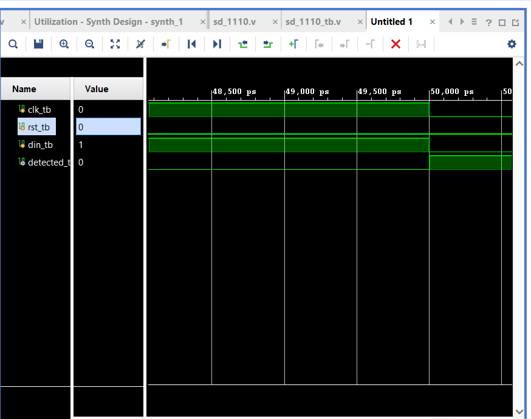

# Day 3: Overlapping Sequence Detector (1110)

## 1. System Overview
This project implements a Synchronous Finite State Machine (FSM) designed to detect a specific binary pattern—**1110**—from a continuous, single-bit input stream (`din`). 

### Overlapping Capability
The design uses an **Overlapping** detection architecture. This means that after a successful sequence match is found, the trailing bits of the completed sequence can instantly be reused as the starting bits for the next sequence. For example, an input stream of `11110` will evaluate correctly, retaining tracking state stability without resetting the system back to the initial state early.

***

## 2. FSM State Architecture
The detector is built as a Mealy-style FSM containing 4 distinct states tracked via a 2-bit state register (`ps` and `ns`):

*   **`idle` (2'b00)**: Default reset state. Looking for the first valid bit (`1`).
*   **`s1` (2'b01)**: First `1` detected. Pattern matched so far: `1`.
*   **`s2` (2'b10)**: Second `1` detected. Pattern matched so far: `11`.
*   **`s3` (2'b11)**: Third `1` detected. Pattern matched so far: `111`. If consecutive `1`s continue to arrive, the FSM safely loops inside `s3` to preserve the overlapping history.

***

## 3. Interface Signal Dictionary

| Pin Name | Direction | Bit-Width | Functional Description |
| :--- | :---: | :---: | :--- |
| `clk` | Input | 1-bit | Master System Clock Signal |
| `rst` | Input | 1-bit | Active-High Synchronous System Reset |
| `din` | Input | 1-bit | Serial Bitstream Input Data Line |
| `detected` | Output | 1-bit | Target Sequence Match Flag (Asserts high on `1110`) |

***

## 4. Verification and Simulation Waveform
The functional verification was executed using Vivado Behavioral Simulator. The testbench drives the full target pattern sequence cleanly to verify timing.

*Figure 1: Behavioral Timing Diagram showing successful 1110 match (`sd_1110.png`)*

### Waveform Analysis
*   **Pattern Input**: The serial data line `din_tb` holds high to satisfy the sequence of three consecutive ones (`111`).
*   **Sequence Completion**: At the **50,000 ps (50 ns)** mark, `din_tb` transitions from high to low (`0`), completing the final requirement for the **1110** pattern.
*   **Assertion Flag**: At that exact clock edge boundary, the output signal `detected_tb` transitions cleanly to a logic high (`1`), proving that the FSM successfully evaluated the stream with zero latency lag.

***

## 5. Synthesis Design Status
*   **Tool Version**: Xilinx Vivado (v2023.2)
*   **Compilation Results**: 0 Errors, 0 Critical Warnings
*   **Hardware Mapping**: Successfully compiled. Transparent latch hazards on the combinational output path were fully neutralized by enforcing strict default state assignments (`detected = 0;`).

