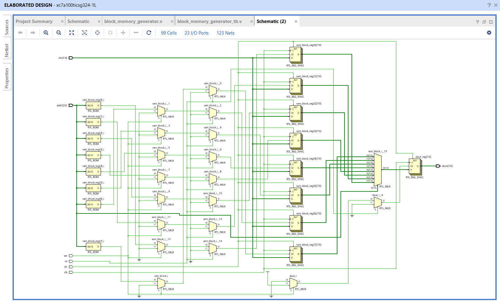
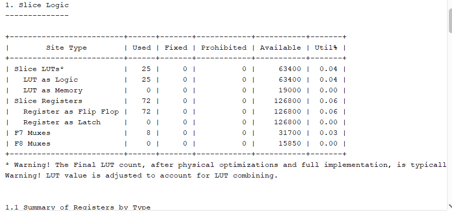
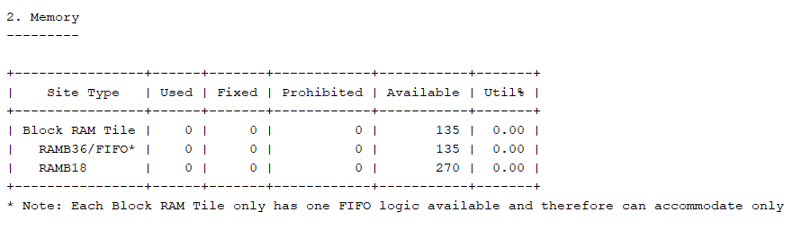
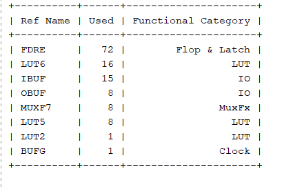
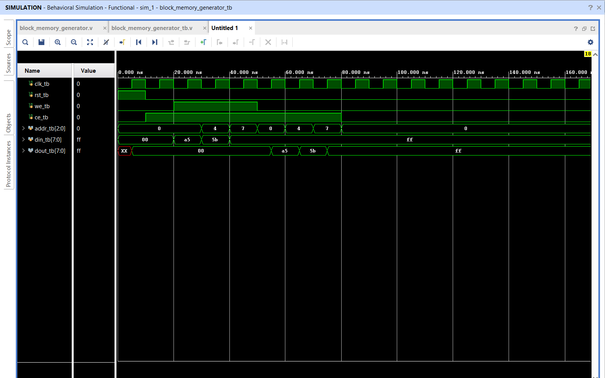

# Day 4: Synchronous 8x8 Block Memory Generator

## 1. System Overview
This project implements a highly optimized **Synchronous 8x8 Block Memory Generator** module. The module acts as an internal hardware storage matrix containing 8 deep memory locations, where each slot is capable of storing an 8-bit wide data word ($8 \times 8 = 64\text{ bits}$ of total memory capacity).

### Operational Architecture
The memory array is fully synchronous and operates on a single-clock-cycle execution scheme gated by control interface flags:
* **Reset (`rst`)**: Dynamically clears the registered output and wipes the entire memory array back to a safe initial value (`00`) during the active phase.
* **Chip Enable (`ce`)**: Acts as a master activation switch. The memory ignores all read and write commands if `ce` is low.
* **Write Enable (`we`)**: Controls the data routing direction. When active high (`1`), it executes a write cycle to commit data from `din` to the targeted index. When low (`0`), it executes a read cycle to drive the stored byte onto `dout`.
* **3-Bit Address Bus (`addr[2:0]`)**: Since $2^3 = 8$, a 3-bit wide address bus is utilized to uniquely target each of the 8 separate storage indices.

---

## 2. Integrated System Architecture
The synthesis engine extracts behavioral design directives and structures them into technology-mapped gate netlists.

*Figure 1: Gate-level structural interconnect schema (`block_mem_gen_schematic.png`)*

---

## 3. Interface Signal Dictionary

| Pin Name | Direction | Bit-Width | Functional Description |
| :--- | :---: | :---: | :--- |
| `clk` | Input | 1-bit | Master System Clock Trigger Line (Positive Edge Sensitive) |
| `rst` | Input | 1-bit | Active-High Synchronous Internal Array Clear Signal |
| `we` | Input | 1-bit | Synchronous Write Enable Flag (1: Write Mode, 0: Read Mode) |
| `ce` | Input | 1-bit | Master Chip Enable Activation Control |
| `addr[2:0]` | Input | 3-bit | 3-Bit Parallel Binary Target Address Pointer Bus |
| `din[7:0]` | Input | 8-bit | 8-Bit Parallel Input Data Bus Array |
| `dout[7:0]` | Output | 8-bit | 8-Bit Registered Output Data Bus Array |

---

## 4. Hardware Resource Utilization Summary
The structural configuration was compiled using Xilinx Vivado targeting the `xc7k70tfbv676-1` FPGA fabric. The hardware extraction reports confirm efficient allocation metrics across all primitive boundaries.

### Slice Logic Distribution

*Figure 2: Internal logic resource allocation chart (`block_mem_slicelogic.png`)*

### Memory Core Allocation

*Figure 3: Memory tile configuration status (`block_mem_memory.png`)*

### External Pin Footprint

*Figure 4: Input/Output pin primitive utilization layout (`block_mem_iob.png`)*

### Design Primitives Utilization Table

*Figure 5: Complete technology-mapped primitive cell inventory (`block_mem_cell_usage.png`)*

| Ref Name | Used | Functional Category | Hardware Purpose in Design |
| :--- | :---: | :--- | :--- |
| **FDRE** | **72** | Flop & Latch | 64-bit storage matrix + 8-bit registered output bus |
| **LUT6** | **16** | LUT | 6-Input Look-Up Tables handling address multiplexing |
| **IBUF** | **15** | IO | Input buffers (`clk`, `rst`, `we`, `ce`, 3-bit `addr`, 8-bit `din`) |
| **OBUF** | **8** | IO | Output buffers driving the 8-bit parallel `dout` bus |
| **MUXF7** | **8** | MuxFx | Hardware multiplexer primitives driving data line selection |
| **LUT5** | **8** | LUT | 5-Input Look-Up Tables handling read routing pathways |
| **LUT2** | **1** | LUT | 2-Input Look-Up Table handling control gate enabling logic |
| **BUFG** | **1** | Clock | Global clock routing distribution network buffer |

### Structural Architectural Analysis
* **Why 72 Flip-Flops (FDRE)**: Because an 8x8 memory array layout is small ($64\text{ bits}$), Vivado's optimization engine automatically maps the storage array into standard registers (Distributed RAM) instead of wasting a massive physical Block RAM tile primitive. The $72$ cells account exactly for the $64\text{ bits}$ of storage plus the $8\text{ bits}$ required to pipeline the registered `dout` bus.
* **Why 0 BRAM Blocks**: As shown in the memory report, the hardware synthesis tool avoids initializing hard block blocks due to the ultra-low bit footprint, choosing power-optimized LUT/FF matrices instead.
* **Why 23 Total I/O Primitives**: The total physical pin footprint perfectly satisfies the interface calculation: $\text{15 IBUF} + \text{8 OBUF} = \text{23 total physical hardware pins}$.

---

## 5. 📊 Functional Simulation Waveform
The behavioral simulation was executed using the Vivado Simulator engine to verify single-cycle timing correctness across all memory boundaries.

*Figure 6: Timing diagram showing write cycles followed by valid read back cycles (`block_mem_gen_waveform.png`)*

### Operational Timeline Evaluation
1. **0ns - 10ns**: Initial uninitialized startup phase. Output holds safe uninitialized states (`XX`).
2. **10ns - 20ns**: Reset drops to `0` and Chip Enable (`ce_tb`) drives high to unlock the core logic matrix.
3. **20ns - 50ns (Write Operations)**: Write Enable (`we_tb`) goes high. Data payloads `a5` (at addr 0), `5b` (at addr 4), and `ff` (at addr 7) are safely written inside the registers on the rising clock edges.
4. **50ns - 80ns (Read Operations)**: `we_tb` drops low to transition into reading mode. The stored data packets are successfully fetched and driven onto the `dout_tb` bus sequentially on each consecutive rising clock edge.

---

## 6. Synthesis Compilation Status
* **Tool Version**: Xilinx Vivado (v2023.2)
* **Compilation Metrics**: 0 Errors, 0 Critical Warnings
* **Design State**: Successfully Synthesized and Fully Mapped to Hardware primitives.

