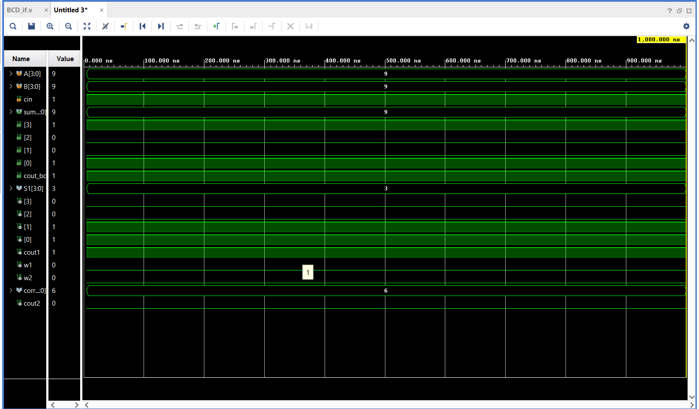
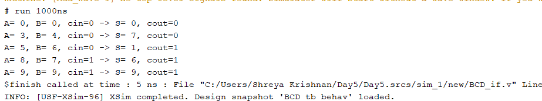

# BCD Adder Verification using SystemVerilog Interfaces

This project implements and verifies a 4-bit Binary Coded Decimal (BCD) Adder using SystemVerilog design and verification concepts. The verification environment utilizes a SystemVerilog `interface` to bundle design signals, simplifying the testbench-to-DUT connection structure.

## Design Architecture
The BCD Adder design is implemented using a multi-stage approach:
1. **Stage 1 (Ripple Carry Adder):** Adds the two 4-bit inputs (`A` and `B`) along with an input carry (`cin`) to produce an initial 4-bit sum (`S1`) and carry-out (`cout1`).
2. **Stage 2 (Detection Logic):** Evaluates whether the intermediate binary sum exceeds decimal 9 or if an intermediate carry occurred.
3. **Stage 3 (Correction Factor):** Generates a correction vector (`4'b0110` or decimal 6) when the detection logic goes active.
4. **Stage 4 (Correction Adder):** Adds the correction factor to the initial sum to generate the final compliant BCD output (`sum_bcd` and `cout_bcd`).

## Verification Methodology
The testbench uses a SystemVerilog `interface` (`bcd_if`) to encapsulate all communication channels. This approach replaces raw `reg` and `wire` signal groupings with an object-oriented, modular connection format. Stimulus tracking is fully driven via direct hierarchical assignment expressions through the interface instance.

## Simulation Outputs

### 1. Functional Waveform
The simulated waveform verifies correct numerical adjustments across all threshold boundaries (including boundary transitions that exceed decimal 9).

### 2. Console Verification Log
The automated testbench environment monitors and outputs real-time signal calculations directly to the runtime console log file.

## How to Run the Simulation (Vivado)
1. Open Xilinx Vivado (v2023.2 or newer).
2. Create a project and add `BCD_if.sv` as a **Simulation Source**.
3. Ensure the file extension is configured as `.sv` (SystemVerilog).
4. Select `BCD_tb` as the simulation top module.
5. Click **Run Simulation** -> **Run Behavioral Simulation** within the Flow Navigator panel.

