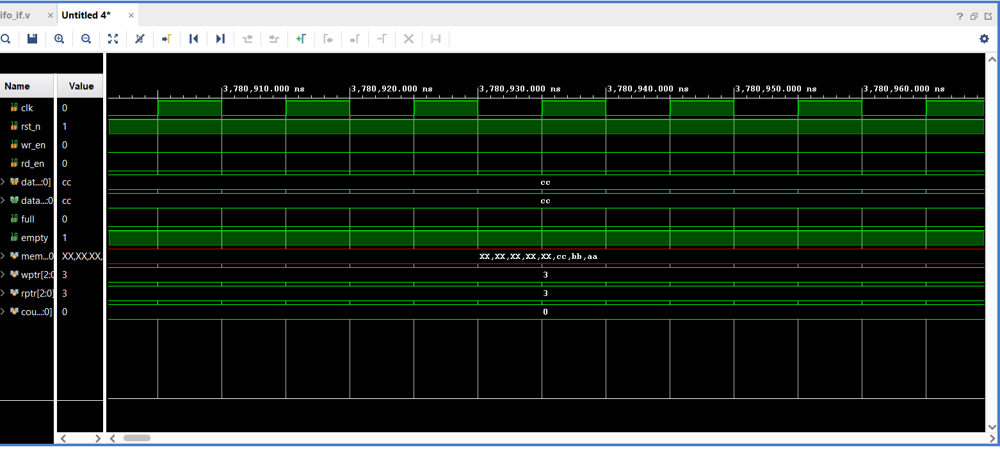
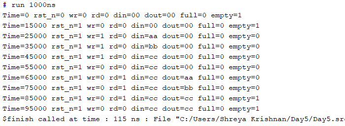

# Synchronous FIFO Verification using SystemVerilog Interfaces

This project implements and verifies a Synchronous First-In, First-Out (FIFO) memory buffer using SystemVerilog design and verification concepts. The verification environment utilizes a SystemVerilog `interface` to encapsulate the clock, controls, and status signals, providing a clean, modular structure for testing sequential hardware blocks.

## Design Architecture
The Synchronous FIFO memory module is implemented using a pointer-driven circular queue structure:
1. **Memory Array:** Built using an internal register memory block (8-location depth, 8-bit wide) to hold buffered data items.
2. **Pointers (Read/Write):** Utilizes dual tracking registers (`rptr` and `wptr`) to keep track of the head and tail indexing positions within the loop.
3. **Control Execution:** Evaluates write requests (`wr_en`) and read requests (`rd_en`) sequentially during the active positive clock edges while ignoring overflow or underflow commands.
4. **Status Flags:** Outputs immediate operational feedback markers (`full` and `empty`) based on direct comparison values between the active read and write index locations.

## Verification Methodology
The testbench environment relies on a SystemVerilog `interface` (`fifo_if`) to manage all communication. Signals are dynamically handled through hierarchical access references (`fif.wr_en`, `fif.data_in`, etc.). The simulation handles sequence tasks including:
* Verification of sequential resets.
* Consecutive write sequences (`0xAA` -> `0xBB` -> `0xCC`) to verify data tracking.
* Consecutive read sequences down to a baseline underflow condition to confirm First-In, First-Out operational order and `empty` flag assertion.

## Simulation Outputs

### 1. Functional Waveform
The simulated waveform tracks clock-edge sync steps, verifying exact data retention, data retrieval ordering, and boundary flag assertions.

### 2. Console Verification Log
The integrated `$monitor` directive automatically dumps internal register and pointer changes to the log window upon value transitions.

## How to Run the Simulation (Vivado)
1. Open Xilinx Vivado.
2. Create a project and add your FIFO source file (`fifo_if.sv`) as a **Simulation Source**.
3. Confirm that the file extension is set to `.sv` to enable SystemVerilog parsing features.
4. Set the FIFO testbench module (`fifo_tb`) as the active simulation top module.
5. Launch the tool via **Run Simulation** -> **Run Behavioral Simulation** within the left-hand Flow Navigator menu.

