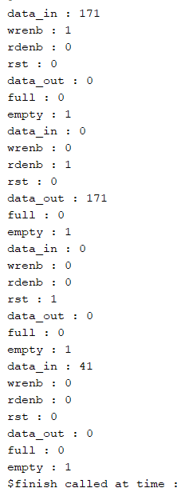

---

## fifo_base_transaction

### Fields
| Field | Type | Description |
|---|---|---|
| `data_in` | `rand bit [7:0]` | 8-bit write data |
| `wrenb` | `rand bit` | Write enable |
| `rdenb` | `rand bit` | Read enable |

### Methods
| Method | Description |
|---|---|
| `new(data)` | Constructor, initialises all fields to 0 |
| `display()` | Prints data_in, wrenb, rdenb |

---

## fifo_transaction

Extends `fifo_base_transaction`.

### Additional Fields
| Field | Type | Description |
|---|---|---|
| `clk` | `rand bit` | Clock |
| `rst` | `rand bit` | Reset |
| `data_out` | `bit [7:0]` | Captured read data |
| `full` | `bit` | FIFO full flag |
| `empty` | `bit` | FIFO empty flag |

### Constraints
| Constraint | Description |
|---|---|
| `valid_ctrl` | Write and read cannot be active simultaneously |
| `valid_rst` | During reset, both wrenb and rdenb are forced to 0 |

### Methods
| Method | Description |
|---|---|
| `new(data, rst)` | Calls super.new(), initialises extended fields |
| `display()` | Calls super.display(), prints all extended fields |
| `set_write(data)` | Configures transaction as a write |
| `set_read()` | Configures transaction as a read |
| `set_reset()` | Configures transaction as a reset |

---

## Simulation Console Output

---

## Transaction Summary

| Transaction | wrenb | rdenb | rst | data_in | data_out |
|---|---|---|---|---|---|
| Write | 1 | 0 | 0 | 171 (0xAB) | 0 |
| Read | 0 | 1 | 0 | 0 | 171 (0xAB) |
| Reset | 0 | 0 | 1 | 0 | 0 |
| Randomized | 0 | 0 | 0 | 41 | 0 |

---

## Constraint Validation

| Scenario | Expected | Result |
|---|---|---|
| `wrenb` and `rdenb` both 1 | Blocked by `valid_ctrl` | ✅ Never occurred |
| `rst=1` with `wrenb` or `rdenb` active | Blocked by `valid_rst` | ✅ Never occurred |

---

## Tool
Xilinx Vivado Simulator (xsim)
