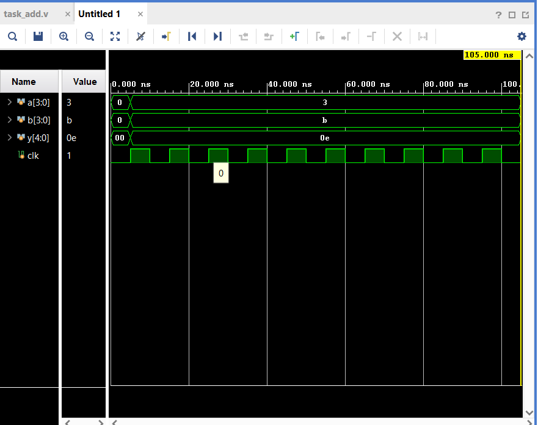

# SystemVerilog Class Methods: Task-Based Testbench

This repository contains a simple SystemVerilog testbench demonstrating the behavior of **Tasks**, simulation timing, and random stimulus generation.

## 📌 Project Overview
The simulation implements an adder module testbench where a custom `task` (`add`) performs arithmetic operations, and a stimulus task (`stim_clk`) generates random inputs synchronized to a clock signal.

### Key Concepts Demonstrated:
* **Tasks with Arguments**: Passing input and output values through task ports.
* **Simulation Time Consumption**: Using `@(posedge clk)` inside tasks to control execution timing.
* **Randomized Testing**: Generating dynamic inputs via the `$urandom()` system function.

---

## 💻 Source Code

```systemverilog
module tb;
  
  // Task definition to add two numbers
  task add (
    input bit [3:0] a,
    input bit [3:0] b,
    output bit [4:0] y
  );
    y = a + b;
  endtask

  bit [3:0] a, b;
  bit [4:0] y;

  // Clock generation (10ns period)
  bit clk = 0;
  always #5 clk = ~clk;

  // Task to handle stimulus on clock edges
  task stim_clk();
    @(posedge clk);
    a = \$urandom();
    b = \$urandom();
    add(a, b, y);
    \(display("Time=\%0t a=\%0d b=\%0d y=\%0d", \)time, a, b, y);
  endtask

  // Main simulation block
  initial begin
    stim_clk();             // Triggers once at the first posedge (5ns)
    repeat (10) @(posedge clk); // Waits for 10 clock cycles (100ns)
    \$finish();              // Halts at exactly 105ns
  end

endmodule
```

---

## 📊 Simulation Results & Waveform

The simulation behavior was verified using a digital waveform simulator. 



### Waveform Analysis:
1. **Timing Alignment**: The simulation initializes at `0 ns` and executes the `stim_clk()` task. The first clock edge triggers at `5 ns`, instantly updating the random variables.
2. **Mathematical Verification**: 
   * Input `a` = `3` (Hex)
   * Input `b` = `b` (Hex, equivalent to decimal 11)
   * Output `y` = `0e` (Hex, equivalent to decimal 14, where $3 + 11 = 14$)
3. **Simulation Lifecycle**: The testbench runs for exactly 10 subsequent clock cycles after the initial trigger, gracefully ending the simulation at exactly **`105.000 ns`**.
