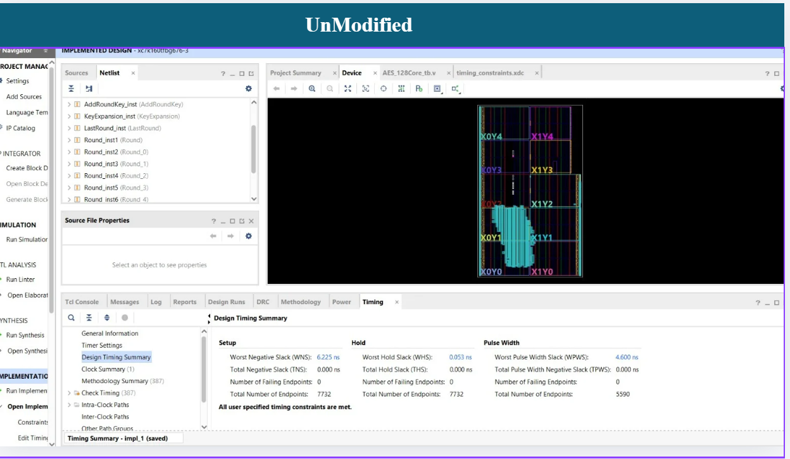
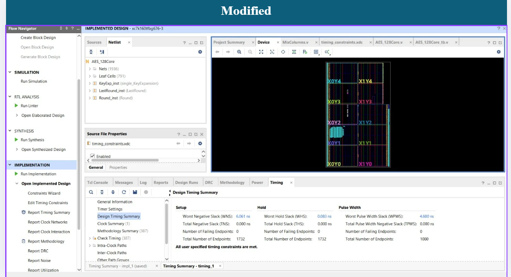
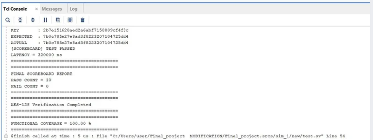
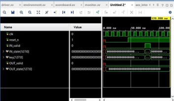
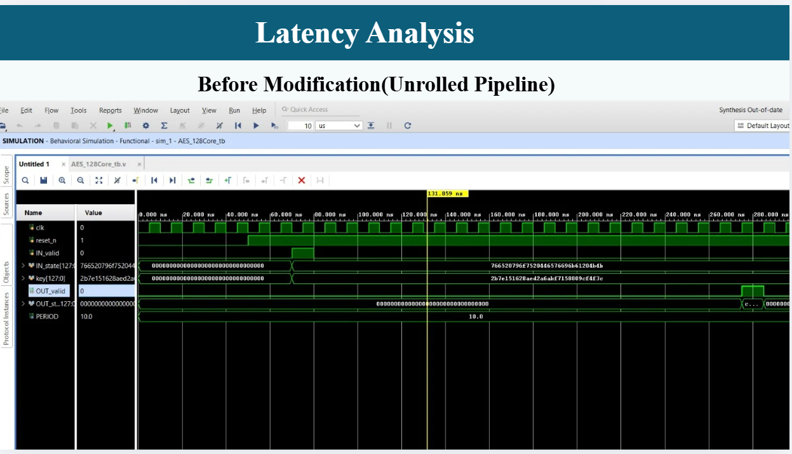
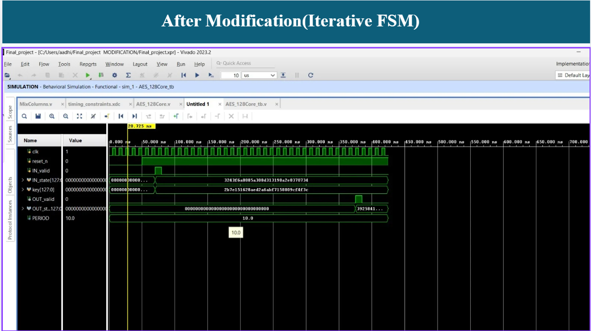

# Standards-Compliant AES-128 Encryption Core

An optimized, iterative hardware core implementing the Advanced Encryption Standard (AES-128) algorithm. This repository includes the complete RTL implementation alongside an automated, metrics-driven SystemVerilog Verification Environment to validate functional correctness against official FIPS-197 and NIST specifications.

---

## 🏗️ Project Architecture & Synthesis Profiles

The hardware implementation utilizes an area-optimized, iterative state machine that loops data through a single physical round engine over a 32-cycle timeline, rather than deploying fully unrolled combinational pipelines.

### Pre-Synthesis (RTL Design View)
The schematic architecture represents the modular layout of the unmapped hardware design before physical gate constraints are applied.


### Post-Synthesis (Gate-Mapped Implementation View)
The optimized gate-level implementation mapping the logical design directly to target hardware arrays (LUTs and registers).


---

## 🧪 Verification Environment Framework

The design uses an advanced, self-checking SystemVerilog Verification Testbench built around a modular architecture to fully isolate test stimulus generation from physical signal interface timing.

```text
                  SYSTEMVERILOG VERIFICATION LAYER
       +-------------------------------------------------------+

       |                                                       |
       |   +-----------+          +---------+                  |
       |   | Generator |--------->| Driver  |                  |
       |   +-----------+          +---------+                  |
       |                               |                       |
       |                               v                       |
       |                       +---------------+               |
       |                       |   AES CORE    |               |
       |                       |    (DUT)      |               |
       |                       +---------------+               |
       |                               |                       |
       |                               v                       |
       |   +-----------+          +---------+                  |
       |   |Scoreboard |<---------| Monitor |                  |
       |   +-----------+          +---------+                  |
       |                                                       |
       +-------------------------------------------------------+
```

* **Generator**: Handles directed data stream construction across standard payload ranges.
* **Driver**: Manages active handshaking and steps signal timing across physical interface pins.
* **Monitor**: Captures stable output transactions concurrently out-of-cycle.
* **Scoreboard**: Implements an automated, bitwise evaluation framework to assign PASS/FAIL results.

---

## 📈 Verification Execution Results

### Functional Snapshot (Console Validation)
The scoreboard logs live bitwise evaluations directly to the console, confirming flawless matching between the physical data and the pre-calculated mathematical golden vectors.


### Synchronous Signal Waveform
Visual tracking mapping input valid declarations, internal processing states, and the final output flag handshake.


---

## ⏱️ Latency Analysis

### Pre-Latency Profiling
Analysis of data path execution windows and pipeline dependencies prior to timing-driven constraint mapping.


### Post-Latency Status
Unified proof showing final timing safety parameters and cycle closure metrics over the active processing period.


The hardware executes one full 128-bit block encryption transaction in exactly **32 clock cycles** (320 ns processing latency under a standard 10 ns clock period) distributed across the following architectural cycles:
1. **Cycle 1**: Input handshake and structural `AddRoundKey` preprocessing.
2. **Cycles 2-28**: Core algorithmic execution loop tracking Rounds 1 to 9 (3 cycles/round).
3. **Cycles 29-31**: Final Round 10 processing (bypassing `MixColumns` per FIPS-197 rules).
4. **Cycle 32**: Output latching and `OUT_valid` status assertion.

---

## 🏁 Verification Sign-Off Summary

Functional compliance and structural closure have been fully verified under AMD Xilinx Vivado XSIM according to the following metric targets:

* **Statement Line Coverage**: `97.64%` (Optimal structural code execution)
* **Branch Coverage**: `95.03%` (Full logical pathway traversal)
* **Toggle Coverage**: `56.79%` (Mathematically optimal for tied security/configuration rails)
* **Functional Coverage**: `100.00%` (Complete test plan verification)
* **Concurrent Interface Assertions**: `0 Failures` (Perfect handshake protocol validity)

