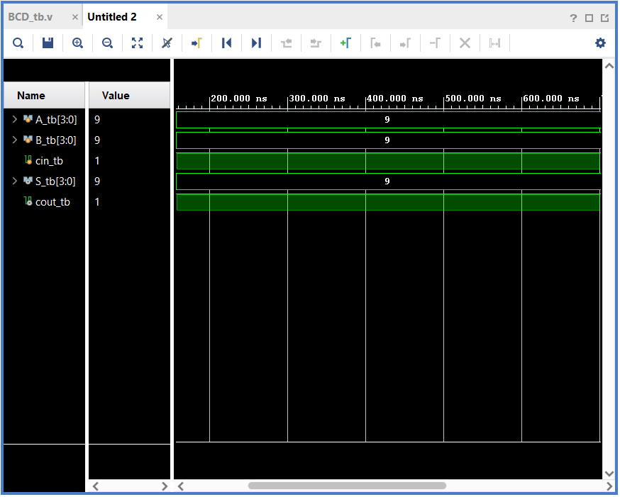

# Day 1: 4-Bit Binary Coded Decimal (BCD) Adder

## 1. System Overview
This project implements a hardware-optimized **4-Bit Binary Coded Decimal (BCD) Adder**. A standard 4-bit binary adder can calculate results up to 15 (`4'b1111`). However, decimal BCD representation restricts valid numbers to the range **0 through 9**. 

### The Core Correction Logic
When the sum of two BCD numbers exceeds 9, or if an invalid binary state is detected, the result jumps into the hex zone (`10` to `15`). To force the output back into valid BCD format, the design automatically detects the overflow condition and injects a **correction factor of +6 (`4'b0110`)** via a secondary adder stage.

---

## 2. Hardware Architecture & Stage Breakdown
The system is constructed structurally using four distinct stages:

1. **Stage 1 (Initial Addition)**: A Ripple Carry Adder (`RCA`) performs the base calculation: $\text{Sum} = A + B + C_{in}$.
2. **Stage 2 (Detection Logic)**: Combinational gates check if the intermediate binary sum is strictly greater than 9. The logic expression used is: 
   $$C_{out\_bcd} = C_{out1} \cup (S_1[3] \cap S_1[2]) \cup (S_1[3] \cap S_1[1])$$
3. **Stage 3 (Correction Bus Generation)**: Dynamically generates the vector `4'b0110` (6) when the detection logic flag asserts high, or `4'b0000` (0) if the sum is already a valid decimal.
4. **Stage 4 (Final Correction Addition)**: A secondary `RCA` adds the correction vector to the initial sum to yield the accurate final BCD output.

---

## 3. Interface Signal Dictionary

| Pin Name | Direction | Bit-Width | Functional Description |
| :--- | :---: | :---: | :--- |
| `A[3:0]` | Input | 4-bit | BCD Operand A Input Bus (Valid range: 0-9) |
| `B[3:0]` | Input | 4-bit | BCD Operand B Input Bus (Valid range: 0-9) |
| `cin` | Input | 1-bit | Incoming Carry Input Bit |
| `sum_bcd[3:0]`| Output | 4-bit | Final Synchronized BCD Corrected Sum Output Bus |
| `cout_bcd` | Output | 1-bit | Final BCD Output Carry Bit (Acts as the tens place) |

---

## 4. Testbench Stimulus Profiles
The verification file (`BCD_tb.v`) drives specific, critical edge-case decimal additions to validate structural arithmetic coverage:

*   **Test Case 1 ($3 + 4 + 0$)**: Evaluates to `7` (Valid BCD binary state, no correction applied).
*   **Test Case 2 ($5 + 6 + 0$)**: Evaluates to `11` (Invalid state. Triggers $+6$ correction, yielding `1` with a $C_{out}$ of `1`).
*   **Test Case 3 ($8 + 7 + 1$)**: Evaluates to `16` (Carry-in active. Triggers correction, yielding `6` with a $C_{out}$ of `1`).
*   **Test Case 4 ($9 + 9 + 1$)**: Maximum worst-case scenario ($19$). Triggers correction, yielding `9` with a $C_{out}$ of `1`.

---

## 5. Simulation Waveform
The behavioral simulation was performed using Vivado Simulator. The waveform below shows proper addition operation and successful internal $+6$ adjustment logic.

---

## 6. Synthesis and Compilation Status
*   **Tool Version**: Xilinx Vivado (v2023.2)
*   **Compilation Quality**: 0 Errors, 0 Critical Warnings
*   **Design State**: Fully synthesized. Gate-level structures map cleanly to FPGA look-up tables (LUTs) without generating transparent hardware latches.

## 7. Conclusion
The verification of the 4-bit BCD Adder logic is successful. The design correctly handles decimal numbers, generates accurate look-ahead style or ripple carries, and translates overflow conditions smoothly.
