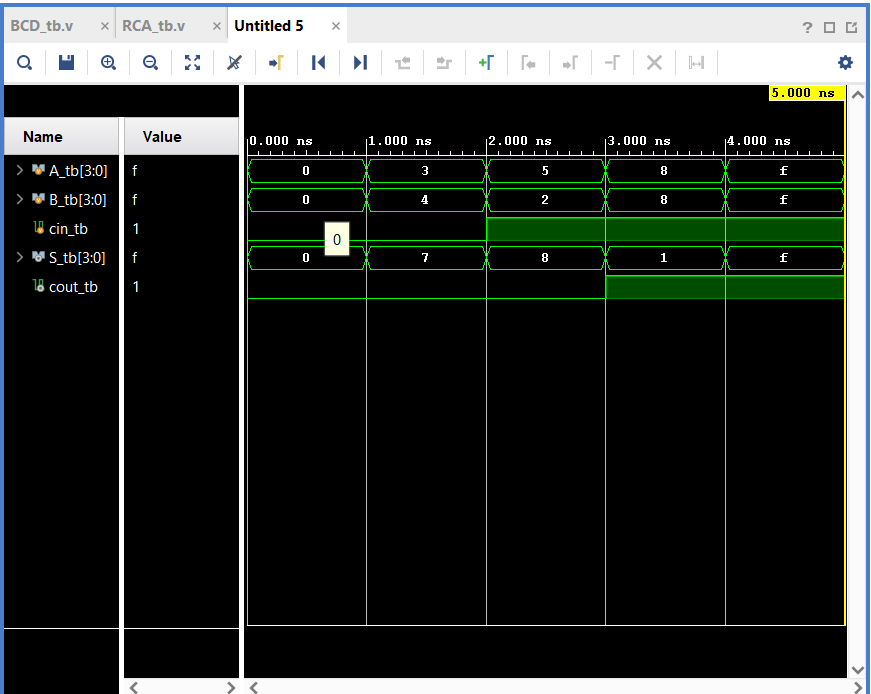

# Ripple Carry Adder (RCA) Design & Verification

## 📊 Simulation Waveform
Below is the output waveform screenshot verifying the 4-bit Ripple Carry Adder functionality across multiple test vectors:

