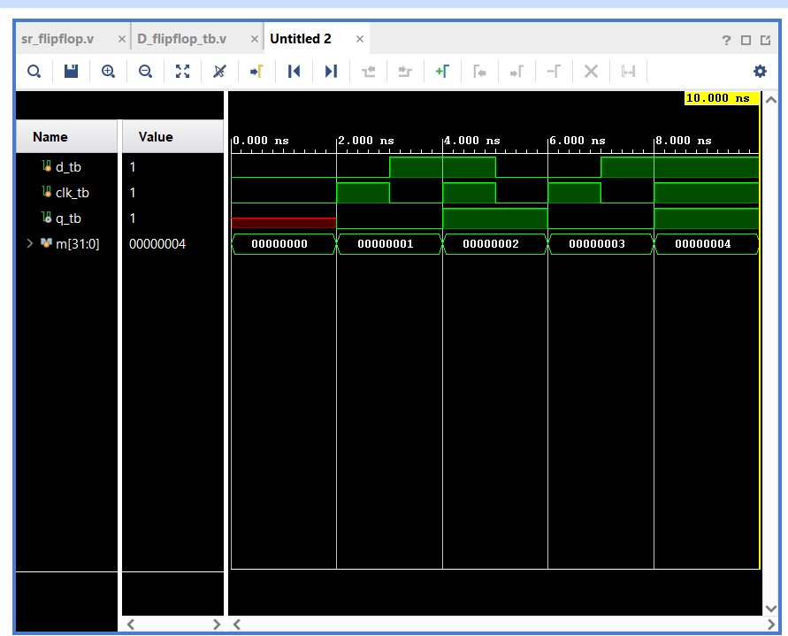

## 📊 Simulation Results
The behavioral simulation was performed using Vivado Simulator. The waveform below demonstrates accurate synchronization between the clock transitions and output tracking, verifying correct functionality against the theoretical truth table.

## 🔍 Conclusion
The verification of the edge-triggered D Flip-Flop is successful. The simulation output confirms that the output `Q` updates dynamically only on the active clock edge and holds its value stably between clock cycles, validating the timing metrics.
